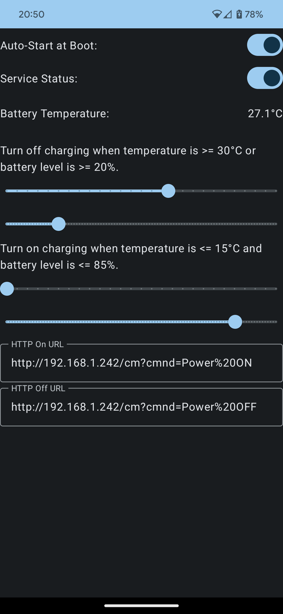

# Battery Service Documentation

## Overview

The `ChargeLimes` is an Android background service designed to optimize the charging of a smartphone by controlling a local network-controlled Wi-Fi smart plug. The service monitors the battery temperature and level, and based on user-defined thresholds, it automatically turns off power to the smart plug to prevent overcharging and overheating. This service is particularly useful for prolonging the battery life of smartphones.

## Features

- **Auto-Start at Boot**: The app can be configured to start automatically when the device boots up.
- **Service Status**: Users can enable or disable the service as needed.
- **Battery Temperature Monitoring**: The service continuously monitors the battery temperature in degrees Celsius.
- **Battery Level Monitoring**: The service monitors the battery level as a percentage.
- **Threshold Settings**: Users can set specific temperature and battery level thresholds for turning off and on the charging.
- **HTTP Control**: The service communicates with Tasmota or any local network-controlled Wi-Fi smart plug using HTTP requests.

## How It Works

1. **Auto-Start**: If configured, the app starts automatically when the device boots up.

2. **Service Status**: Users can manually enable or disable the service via a toggle switch.

3. **Battery Monitoring**: The service monitors the battery temperature and level using the Android BatteryManager.

4. **Thresholds**: Users can define temperature and battery level thresholds for turning off and on the charging. The thresholds are as follows:
   - Turn off charging when the temperature is greater than or equal to a specified value (in degrees Celsius).
   - Turn off charging when the battery level is greater than or equal to a specified percentage.
   - Turn on charging when the temperature is less than or equal to a specified value (in degrees Celsius).
   - Turn on charging when the battery level is less than or equal to a specified percentage.

5. **HTTP Control**: The service communicates with the smart plug by sending HTTP requests. Users can configure the following URLs:
   - HTTP On URL: The URL to turn on power to the smart plug.
   - HTTP Off URL: The URL to turn off power to the smart plug.

## Usage

1. Install the app on your Android device.

2. Launch the app and configure the desired settings, including temperature and battery level thresholds, HTTP URLs, and auto-start preferences.

3. Enable the service via the toggle switch.

4. The service will continuously monitor the battery temperature and level.

5. When the defined conditions are met, the service will send HTTP requests to control the smart plug and optimize charging.

## Note

- This app is designed to work with Tasmota or any local network-controlled Wi-Fi smart plug that can be controlled via HTTP requests.
- Properly configure the HTTP URLs to control your specific smart plug model.
- Use this app responsibly, as it can significantly impact your device's charging behavior.

---
